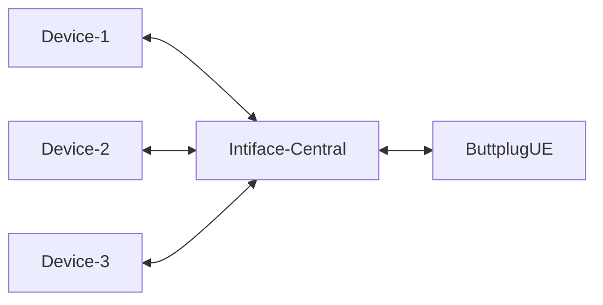
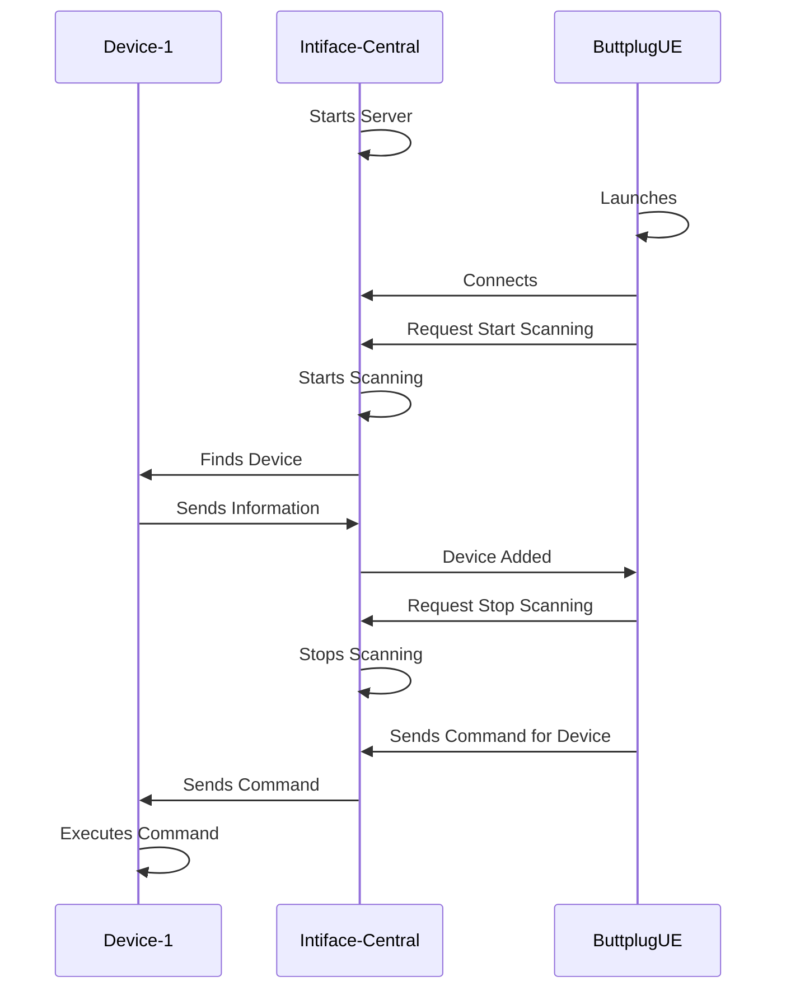

# Buttplug UE

An Unreal Engine integration for the [Buttplug.io](https://buttplug.io/) framework.

---

## Overview

Buttplug UE is a plugin for the Unreal Engine that implements the [Buttplug.io](https://buttplug.io/) framework for controlling a wide range of *external devices* and other peripherals directly from your game.

### Architecture

Buttplug.io and this plugin work through the [Intiface Central](https://intiface.com/central/) application, like so:

This way Intiface handles all the troublesome work of identifying, querying, and controling the devices, and ButtplugUE simply requests information about the devices, which tells it how to pass along commands. All communication between Unreal and Intiface is through a [Websocket](https://docs.unrealengine.com/5.0/en-US/API/Runtime/WebSockets/) via JSON formatted messages.

On the Unreal end, we handle this through a [Game Instance Subsystem](https://docs.unrealengine.com/5.0/en-US/programming-subsystems-in-unreal-engine/), which means a connection to the Intiface server is persistent throughout the gameplay session, between map changes and more.

Information about Devices is handled in the form of Structs; this plugin makes heavy use of the [Struct Utils](https://docs.unrealengine.com/5.1/en-US/API/Plugins/StructUtils/) plugin to simplify the serialization and deserialization of information coming in and out of Intiface.

The storing and handling of persistent device information is not included in this plugin at this time; this functionality is left to you, the developer, to implement as-needed for your specific use-case.

### Exmaple Procedure

The basic flow of interacting with a device, from start to end, is:

## Quick Start

## Planned Features

## Further Reading