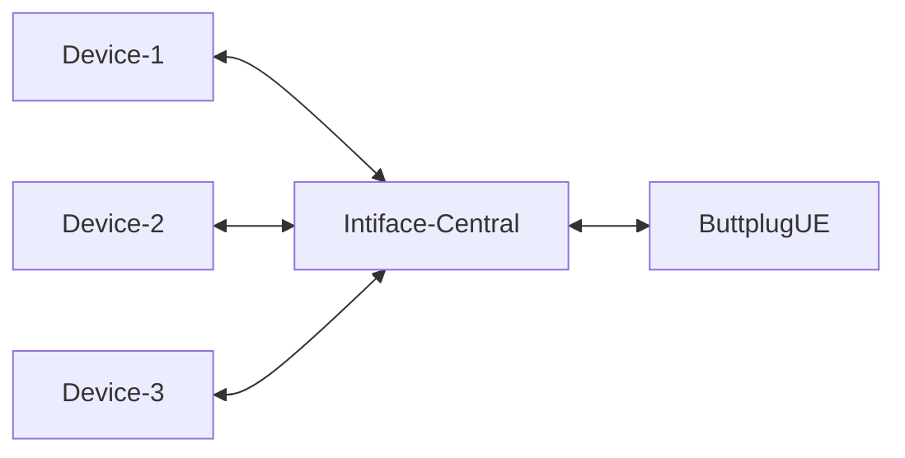
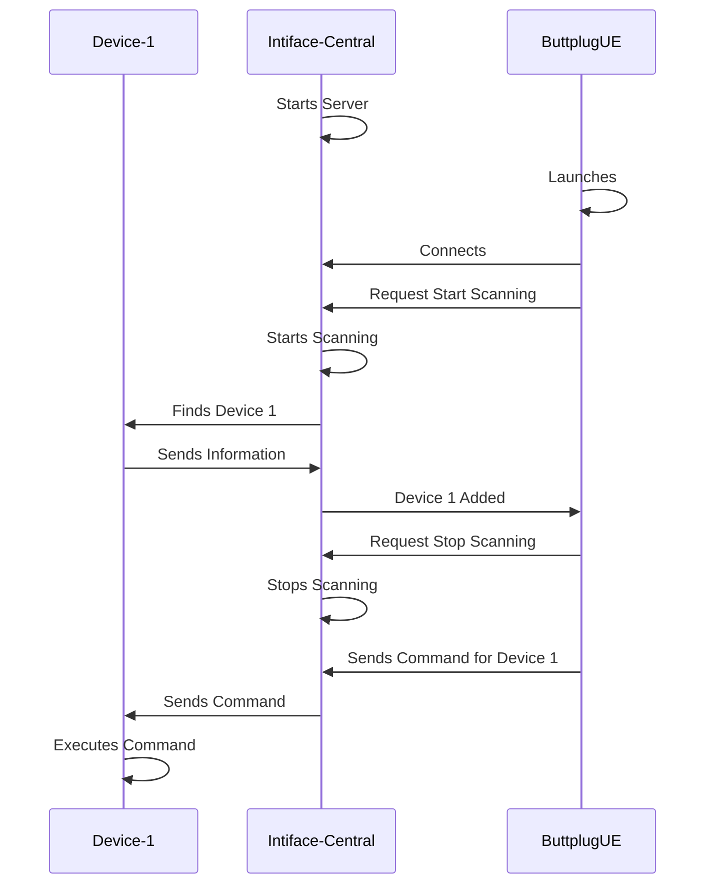

# Buttplug UE

An Unreal Engine integration for the [Buttplug.io](https://buttplug.io/) framework.

---

## Overview

Buttplug UE is a plugin for the Unreal Engine that implements the [Buttplug.io](https://buttplug.io/) framework for controlling a wide range of *external devices* and other peripherals directly from your game.

### Architecture

Buttplug.io and this plugin work through the [Intiface Central](https://intiface.com/central/) application, like so:

This way Intiface handles all the troublesome work of identifying, querying, and controling the devices, and ButtplugUE simply requests information about the devices, which tells it how to pass along commands. All communication between Unreal and Intiface is through a [Websocket](https://docs.unrealengine.com/5.0/en-US/API/Runtime/WebSockets/) via JSON formatted messages.

On the Unreal end, we handle this through a [Game Instance Subsystem](https://docs.unrealengine.com/5.0/en-US/programming-subsystems-in-unreal-engine/), which means a connection to the Intiface server is persistent throughout the gameplay session, between map changes and more.

Information about Devices is handled in the form of Structs; this plugin makes heavy use of the [Struct Utils](https://docs.unrealengine.com/5.1/en-US/API/Plugins/StructUtils/) plugin to simplify the serialization and deserialization of information coming in and out of Intiface.

The storing and handling of persistent device information is not included in this plugin at this time; this functionality is left to you, the developer, to implement as-needed for your specific use-case.

It is highly recommended to familiarize yourself with the [Buttplug.io specs](https://buttplug-developer-guide.docs.buttplug.io/docs/spec) to have a better understanding of how the different messages and commands work.

### Example Procedure

The basic flow of interacting with a device, from start to end, is:

As you can see, this means that all communication to and from ButtplugUE is with Intiface Central, whether it is looking for devices, getting information about them, or sending commands.

## Quick Start

By default, the ButtplugUE plugin will automatically attempt to connect to a locally running Intiface instance at the default address and port (`127.0.0.1:12345`) so launch Intiface and start it with the defaults and on launch your Unreal instance should connect. Check the log (category `LogButtplugUE`) for messages confirming as such.

You can change these settings in `Project Settings > Plugins > ButtplugUE Settings`. You can also connect to Intiface instances running on the local network, assuming you have a basic network environment.

Next you will want to get a list of devices. This can be achieved either by telling Intiface to start (and stop) scanning via the normal Intiface GUI or by sending the appropriate commands via the `BPDeviceSubsystem`. You can send either `Start Scanning` or `Get Device List`.

The former will start Intiface scanning for devices, where as the latter will return a list of previously found devices. To receive the responses you will need to either bind to the `Response` delegate from the `RequestDeviceList` function, or bind to the `OnDeviceAddedResponse` delegate in `BPDeviceSubsystem`, as after you start scanning you will get a `DeviceAdded` message after each new device is found and registered with Intiface, and you will need to send the `StopScanning` command afterwards.

Now that you have a list of devices to choose from, you can send an appropriate command. Each device will have a list of `Scalar`, `Linear`, and `Rotate` commands based on what kind of action the device supports. Simply send the appropriate type of command and your device should

## Planned Features

## Further Reading