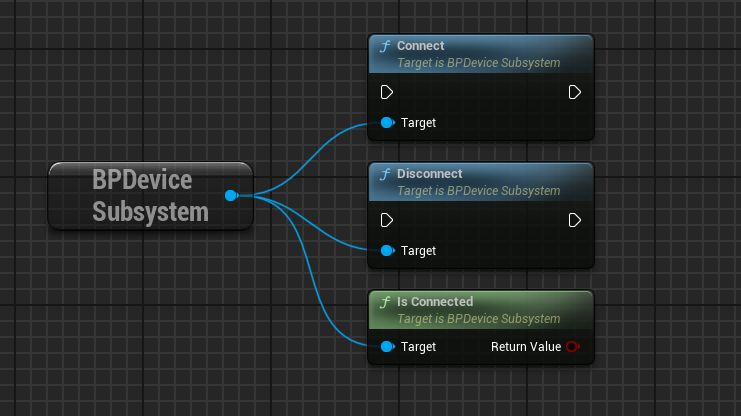
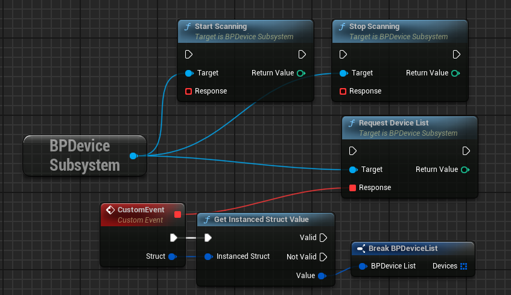
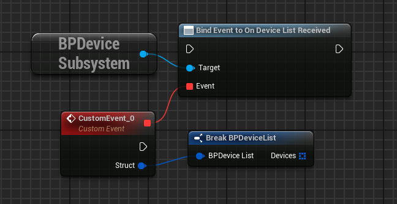
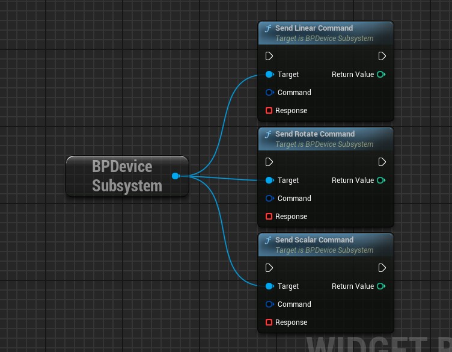
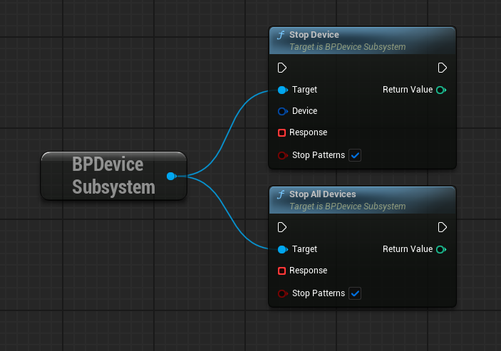
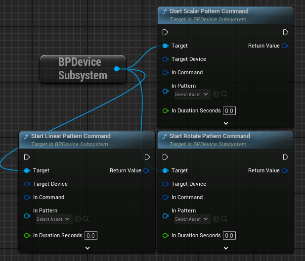

# Buttplug UE

An Unreal Engine integration for the [Buttplug.io](https://buttplug.io/) framework.

If you use this in your project(s), please consider supporting its continued development on my [Patreon](https://www.patreon.com/DeviantdVeloper) or [SubscribeStar](https://subscribestar.adult/deviant-dveloper).

---

## Projects Using this Plugin

Let me know if you want your project featured here!

## Overview

Buttplug UE is a plugin for the Unreal Engine that implements the [Buttplug.io](https://buttplug.io/) framework for controlling a wide range of *external devices* and other peripherals directly from your game.

It provides both a Blueprint and a C++ interface (via a [Game Instance Subsystem](https://dev.epicgames.com/documentation/en-us/unreal-engine/API/Runtime/Engine/Subsystems/UGameInstanceSubsystem?application_version=5.3)) which allows you to directly manage individual devices, as well as providing basic support for "fire-and-forget" device commands.

Tested with Intiface Central v2.6.4+30

### Supported Engine Versions

| Engine | Supported        | Notes                               |
| ------ | ---------------- | ----------------------------------- |
| <= 5.0 | No               |                                     |
| 5.1    | Deprecated       | Check Releases, No Example Content  |
| 5.2    | Deprecated       | Check Releases                      |
| 5.3    | Yes              | No Example Content (check releases) |
| 5.4    | Yes              |                                     |
| 5.5    | Yes              |                                     |

### Supported Platforms

| Platform | Supported | Notes       |
| -------- | --------- | ----------- |
| Windows  | Yes       | 64bit Only  |
| Android  | Yes       |             |
| Linux    | Probably  | Let me know |
| OSX      | Probably  | Let me know |
| iOS      | Probably  | Let me know |

### Architecture

Buttplug.io and this plugin work through the [Intiface Central](https://intiface.com/central/) application, like so:

This way Intiface handles all the troublesome work of identifying, querying, and controling the devices, and ButtplugUE simply requests information about the devices, which tells it how to pass along commands. All communication between Unreal and Intiface is through a [Websocket](https://docs.unrealengine.com/5.0/en-US/API/Runtime/WebSockets/) via JSON formatted messages.

On the Unreal end, we handle this through a [Game Instance Subsystem](https://docs.unrealengine.com/5.0/en-US/programming-subsystems-in-unreal-engine/), which means a connection to the Intiface server is persistent throughout the gameplay session, between map changes and more.

Information about Devices is handled in the form of Structs; this plugin makes heavy use of the [Struct Utils](https://docs.unrealengine.com/5.1/en-US/API/Plugins/StructUtils/) plugin to simplify the serialization and deserialization of information coming in and out of Intiface.

The storing and handling of persistent device information is not included in this plugin at this time; this functionality is left to you, the developer, to implement as-needed for your specific use-case.

It is highly recommended to familiarize yourself with the [Buttplug.io specs](https://buttplug-developer-guide.docs.buttplug.io/docs/spec) to have a better understanding of how the different messages and commands work.

### Basics

First you will want to initialize the connection to Intiface

After this you should check if the connection was successful. And of course remember to Disconnect upon closing your game.

Once you are connected you can tell the server to start, then stop scanning for devices, and then request a list of devices:

Note that the response is an Instanced Struct, and you have to manually tell it what struct type you are looking for, much like casting.

This can be circumvented by binding to the appropriate delegate/callback on the subsystem *prior* to making the request. This way you will recieve a correctly typed struct every time.

Finally, you can now send commands to  the devices in question. Each device struct outlines what commands they are compatible with, and as such you can use this information to know what type of command to send.

This is a single command, and as such you will also need to tell it when to stop; sending a strength of 0 or using one of the Stop commands will achieve this.

These functions behave as you would expect: stopping a given device, or stopping all devices (wise to do on quit, close, exit, etc). They optionally also can either ignore or include currently ongoing Pattern Commands, as these are handled locally in the plugin.

A simpler approach is to use the "Pattern Command"

These pattern commands take a Duration and a Float Curve as arguments. The Curve dictates the strength and will loop for the duration, self-ending. These essentially sample the given curve at the set rate, sending updates to the device per-update.

### Example Procedure

The basic flow of interacting with a device, from start to end, is:

As you can see, this means that all communication to and from ButtplugUE is with Intiface Central, whether it is looking for devices, getting information about them, or sending commands.

## Quick Start

For the fastest start simply open the `Debug_P` map in the ButtplugUE content folder and play it. This will bring up an on-screen UI that will allow you to connect to and manipulate connected devices through Intiface. The UI itself can be found in the UI folder of the plugin's content where you can see how it, and its sub-components, do the things it does.

By default, the ButtplugUE plugin will automatically attempt to connect to a locally running Intiface instance at the default address and port (`127.0.0.1:12345`) so launch Intiface and start it with the defaults and on launch your Unreal instance should connect. Check the log (category `LogButtplugUE`) for messages confirming as such.

You can change these settings in `Project Settings > Plugins > ButtplugUE Settings`. You can also connect to Intiface instances running on the local network, assuming you have a basic network environment; you are not limited to the same machine it is running on.

Next you will want to get a list of devices. This can be achieved either by telling Intiface to start (and stop) scanning via the normal Intiface GUI or by sending the appropriate commands via the `BPDeviceSubsystem`. You can send either `Start Scanning` or `Get Device List`.

The former will start Intiface scanning for devices, where as the latter will return a list of previously found devices. To receive the responses you will need to either bind to the `Response` delegate from the `RequestDeviceList` function, or bind to the `OnDeviceAddedResponse` delegate in `BPDeviceSubsystem`, as after you start scanning you will get a `DeviceAdded` message after each new device is found and registered with Intiface, and you will need to send the `StopScanning` command afterwards.

Now that you have a list of devices to choose from, you can send an appropriate command. Each device will have a list of `Scalar`, `Linear`, and `Rotate` commands based on what kind of action the device supports. Simply send the appropriate type of command and your device should respond appropriately.

ButtplugUE closes it's connection with Intiface when play ends, but you can also manually disconnect (and reconnect) through the Subsystem if desired.

## Planned Features

The following are features that are not yet implemented, but will be at a later date.

In no particular order:

- Sensor Support.
- Pre-programmed device commands, eg pulsing, ramping, fire-and-forget durations. `Intial Implementation Done`
    - Custom curve support. `Somewhat Implemented`
- Further abstraction from command types, simplified developer front-end.
- Double check if there are any replication implications from using `UGameInstanceSubsystem` (spoiler, there are).
    - This might mean moving (or duplicating) the behaviour to a `UObject`, thereby making replication the responsibility of you, the developer.

## Further Reading

- [Buttplug.io Specs](https://buttplug-developer-guide.docs.buttplug.io/docs/spec)
- [Unreal Engine Subsystems](https://docs.unrealengine.com/5.0/en-US/programming-subsystems-in-unreal-engine/)
- [Unreal Engine Struct Utils](https://docs.unrealengine.com/5.1/en-US/API/Plugins/StructUtils/)

## Support & Supporting

If you use this in your project(s), please consider supporting its continued development on my [Patreon](https://www.patreon.com/DeviantdVeloper) or [SubscribeStar](https://subscribestar.adult/deviant-dveloper), as well as that of the official [Buttplug.io](https://www.patreon.com/qdot) development.

You can contact me here, on [Bluesky](https://bsky.app/profile/ddev.games), or Discord (\_ddev\_).
